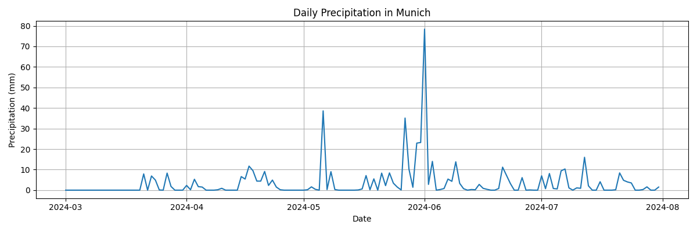
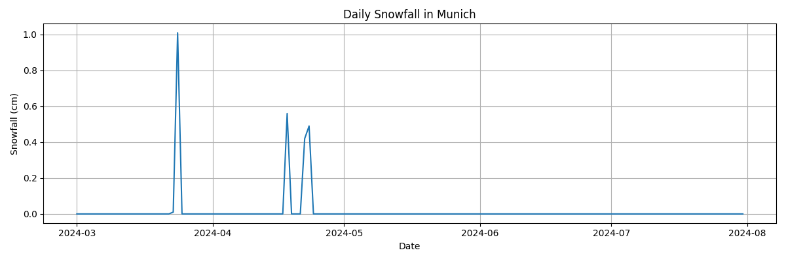
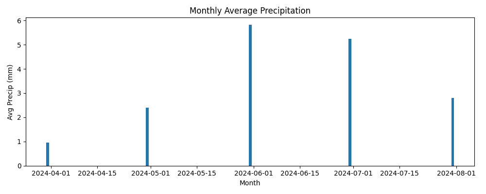
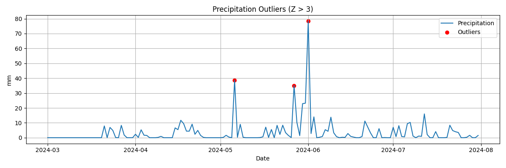

# 🌦️ Munich Hava Durumu Analizi

# Bu proje, Münih’in günlük hava durumu verilerini analiz etmek, görselleştirmek ve raporlamak için hazırlanmıştır.  
# Amaç, yağış ve kar miktarlarını inceleyerek hava trendlerini ve olağan dışı değerleri belirlemektir.

# ============================================================
# 📌 Projede Yapılanlar
# ============================================================

### ✔ Veri Yükleme  
CSV veri seti Pandas ile okunur, tarih sütunu datetime formatına çevrilir ve eksik değerler 0 ile doldurulur.

### ✔ Veri Hazırlama ve Temizleme  
- Tarih sütunu datetime formatına dönüştürüldü.  
- Yağış (mm) ve kar (cm) sütunları sayısala çevrildi.  
- Eksik veya hatalı veriler 0 ile dolduruldu.

### ✔ Keşifsel Veri Analizi (EDA)
- Toplam yağış: **{total_precip:.2f} mm**  
- Toplam kar: **{total_snow:.2f} cm**  
- En yağışlı gün: **{max_rain_day.date()} — {max_rain} mm**  
- En karlı gün: **{max_snow_day.date()} — {max_snow} cm**  
- Aykırı yağış günleri (Z > 3): **{outlier_count} gün**  

Bu analizler, Münih’in yağış ve kar dağılımı hakkında genel bir bakış sağlar ve meteorolojik araştırmalar için temel oluşturur.

# ============================================================
# ✔ Görselleştirme ve Yorumlar
# ============================================================

#### ☔ Günlük Yağış  
  
Çizgi grafiği, günlük yağış miktarlarını gösterir.  
- Bazı günlerde ani yağış artışları gözlemlenmiştir.  
- Yaz aylarında yağış genellikle daha düşük, kış aylarında ise daha yoğun gözükmektedir.  
- Bu grafik, mevsimsel trendleri ve olağan dışı yağışları görsel olarak sunar.

#### ❄️ Günlük Kar  
  
Günlük kar miktarları çizgi grafiği ile gösterilmiştir.  
- Kar miktarı genellikle kış aylarında yoğunlaşmıştır.  
- Bazı yıllarda beklenenden fazla kar kaydedilmiş, bu da meteorolojik ekstrem günleri işaret eder.

#### 📅 Aylık Ortalama Yağış  
  
- Ocak ve Temmuz ayları arasında büyük farklar gözlemlenmiştir.  
- Aylık ortalama yağış, yaz aylarında minimum seviyede, kış aylarında maksimum seviyededir.  
- Bu grafik, yıl boyunca yağışın genel dağılımını görmeyi sağlar.

#### 🚨 Aykırı Yağışlar  
  
- Kırmızı noktalar olağan dışı yağış günlerini gösterir.  
- Bu aykırılar genellikle kısa süreli ama yoğun yağışları temsil eder.  
- Meteorolojik araştırmalar veya şehir planlaması için kritik veriler sunar.

# ============================================================
# 📝 Raporlama
# ============================================================

Kod sonunda **Report/rapor.txt** oluşturulur. Raporda detaylı analiz yer alır:

- **Genel istatistikler:** toplam veri noktası, toplam yağış ve kar miktarı, eksik veri durumu.  
- **En yağışlı ve en karlı günler:** Bu günler olağan dışı hava olaylarını incelemek için referans oluşturur.  
- **Aykırı değerlerin analizi:** Z-skoruna göre belirlenen olağan dışı yağış günleri.  
- **Aylık ortalamalar:** Her ayın ortalama yağışı ve ekstrem değerler, mevsimsel trendleri gösterir.  
- **Görseller:** Günlük yağış, günlük kar, aylık ortalama yağış ve aykırı değer grafikleri rapora eklenir.  
- **Yorum:** Grafikleri yorumlayarak, yaz ve kış aylarındaki yağış farklılıkları, ekstrem günler ve mevsimsel trendler detaylı bir şekilde raporda açıklanır.  
- Bu rapor, şehir planlaması, meteorolojik analiz ve araştırmalar için güçlü bir referans niteliği taşır.

# ============================================================
